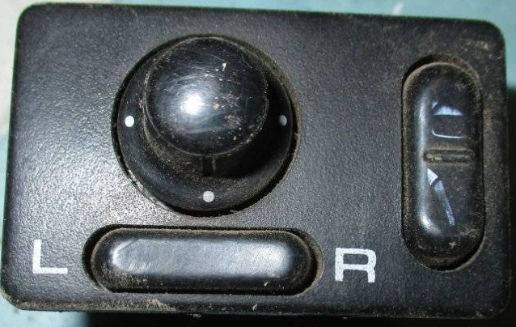

# Зеркала

## Блок управления зеракалами
https://nissan.epcdata.ru/laurel/HC33/1172-k/electric/251/25560M/

### Номера по каталогу
 - 2557085E00
 - 2557091L00
 - 2557091L05
 - 2557091L10
 - 2557091L1E

### Номера от других авто
 - 2557010V00
 - 2557051E00
 - 2557051E10
 - 255700H000
 - 255700H005

### Блок с регулировкой

### Блок со складыванием

### Блок с подогревом

## Боковые зеркала

### Номера по каталогу

### Простые зеркала

### Антибликовые зеркала

## Зеркало на лобовом стекле

### Номера по каталогу

### Простые зеркала

### Антибликовые зеркала

